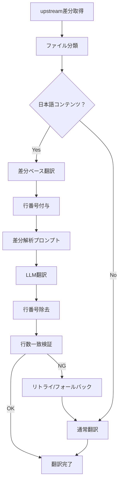

# JHipster 日本語ドキュメント自動翻訳システム

このシステムは、JHipster英語版ドキュメントを自動的に日本語に翻訳するためのツールです。
Gemini 1.5 Flash APIを使用し、**差分ベース翻訳**により必要最小限の変更のみを適用します。

## 主な機能

### 🎯 差分ベース最小限翻訳（新機能）
- upstream commitの差分を分析し、意味変更のない修正（typo、URL変更等）は日本語を維持
- 行番号システム（L0001=形式）により、LLM出力の整合性を保証
- 表面的変更と実際の内容変更を自動判別

### 🔄 自動翻訳パイプライン
- GitHub Actionsによる定期実行（毎日12:00 JST）
- 手動実行にも対応
- 衝突ファイルの2段階自動解決

### 📊 高度な品質管理
- 翻訳前後の行数一致検証
- LanguageToolによる文法チェック
- プロンプト・差分・結果の完全記録（artifacts）
- LLMによる翻訳品質分析

### 🎨 スタイルガイド対応
- 基本スタイルガイド + ファイル別カスタマイズ
- 常体統一、用語統一表の適用
- リリースノート等の特別な文体指定

## クイックスタート

### 1. 開発環境セットアップ

```bash
cd .github/auto-translation
make dev-setup
```

### 2. 環境変数設定

`.env`ファイルを作成し、必要なAPIキーを設定：

```bash
cp .env.sample .env
# .envファイルを編集してAPIキーを設定
```

### 3. テスト実行

```bash
make test
```

### 4. 翻訳実行

```bash
# ドライランモード（実際の翻訳・コミット・PRなし）
make run-dry

# 実際の翻訳実行
COMMIT_HASH=abc1234 make run
```

## 使用方法

### コマンドライン

#### 統合パイプライン実行（推奨）

```bash
# 指定したコミットハッシュで差分ベース翻訳を実行
python scripts/run_translation_pipeline.py --hash abc1234def

# ドライランモード
python scripts/run_translation_pipeline.py --hash abc1234def --dry-run
```

#### 個別スクリプト実行

```bash
# 1. upstream取得とマージ
python scripts/fetch_upstream.py --hash abc1234def

# 2. 変更分類
python scripts/classify_changes.py

# 3. 差分ベース翻訳（新機能）
python scripts/translate_chunk.py \
  --classification classification.json \
  --mode selective \
  --commit-hash abc1234def

# 4. 後処理
python scripts/postprocess.py --classification classification.json

# 5. コミット・PR作成
python scripts/commit_and_pr.py --classification classification.json
```

### 翻訳モード

| モード | 対象 | 説明 |
|-------|------|------|
| `all` | a, b-1, b-2 | 全ての翻訳対象ファイル（衝突あり含む） |
| `selective` | a, b-1 | 新規・更新（衝突なし）のみ（デフォルト） |
| `new-only` | a | 新規ファイルのみ |

### 差分ベース翻訳の仕組み

#### 1. 差分取得
```bash
git show --unified=3 {commit_hash} -- {file_path}
```

#### 2. 行番号付与
```
L0001=これはJHipsterのガイドです。
L0002=設定方法について説明します。
L0003=
```

#### 3. 差分ベース翻訳プロンプト
- upstream差分情報
- 意味変更なし箇所の保護指示
- 行番号付き出力形式の指定

#### 4. 整合性検証
- 行数一致チェック
- 失敗時の保守的フォールバック

## アーキテクチャ

### ディレクトリ構成

```
.github/auto-translation/
├── scripts/                   # 実行スクリプト
│   ├── run_translation_pipeline.py    # 統合パイプライン
│   ├── fetch_upstream.py              # upstream取得
│   ├── classify_changes.py            # 変更分類
│   ├── translate_chunk.py             # 翻訳（差分ベース強化）
│   ├── postprocess.py                 # 後処理
│   └── commit_and_pr.py               # コミット・PR
├── tests/                     # テストファイル
├── docs/                      # スタイルガイド
├── artifacts/                 # 翻訳過程のログ（新機能）
├── Makefile                   # 便利コマンド
├── pyproject.toml            # 依存関係
└── requirements.txt          # pip用依存関係
```

### 翻訳フロー



### Artifacts記録

翻訳過程で以下のファイルが自動生成されます：

- `prompt_*.md`: LLMに送信されたプロンプト
- `diff_*.diff`: upstream差分情報
- `original_*.md`: 翻訳前日本語コンテンツ
- `result_*.md`: 翻訳結果
- `conflict_*_*.md`: コンフリクト翻訳の詳細ログ

## 環境変数

| 変数名 | 必須 | 説明 |
|--------|------|------|
| `GEMINI_API_KEY` | ✅ | Gemini API キー |
| `GITHUB_TOKEN` / `GH_TOKEN` | ✅ | GitHub Token（PR作成用） |
| `BOT_GIT_USER` | ⚠️ | コミットユーザー名（デフォルト: github-actions[bot]） |
| `BOT_GIT_EMAIL` | ⚠️ | コミットメール（デフォルト: actions用メール） |
| `LANGUAGE_TOOL_ENABLED` | ⚠️ | LanguageTool有効化（デフォルト: false） |
| `DRY_RUN` | ⚠️ | ドライランモード（デフォルト: false） |

## 設定ファイル

### スタイルガイド

- `docs/style-guide.md`: 基本スタイルガイド
- `docs/style-guide-release.md`: リリースノート用

### カスタマイズ

特定のフォルダに対してカスタムスタイルガイドを適用：
- `docs/releases/` → リリースノート用スタイル（です・ます調）

## トラブルシューティング

### よくある問題

#### 1. 行数不一致エラー
```
⚠️  Line count mismatch: original=10, translated=8
```
**原因**: LLMが行を削除または結合
**対策**: リトライ後、通常翻訳にフォールバック

#### 2. 差分取得失敗
```
⚠️  No diff available for file.md, using regular translation
```
**原因**: ファイルが該当コミットで変更されていない
**対策**: 自動的に通常翻訳にフォールバック

#### 3. API制限エラー
```
❌ Diff-based translation attempt failed: API quota exceeded
```
**対策**: 時間をおいて再実行、またはAPI制限を確認

### ログの確認

#### 実行ログ
```bash
# 詳細ログを確認
cat .github/auto-translation/*.log
```

#### Artifacts確認
```bash
# 翻訳過程の詳細を確認
ls -la .github/auto-translation/artifacts/
```

## ライセンス

MIT License - JHipster プロジェクトと同じライセンスを継承

## 貢献

### 開発環境

```bash
# 開発用セットアップ
make dev-setup

# テスト実行
make test

# コード品質チェック
make lint
```

### プルリクエスト

1. 機能追加や修正を行う
2. テストを追加/更新
3. `make test`でテストが通ることを確認
4. プルリクエストを作成

## 参考

- [JHipster公式サイト](https://www.jhipster.tech/)
- [Gemini API ドキュメント](https://ai.google.dev/docs)
- [スタイルガイド詳細](docs/style-guide.md)